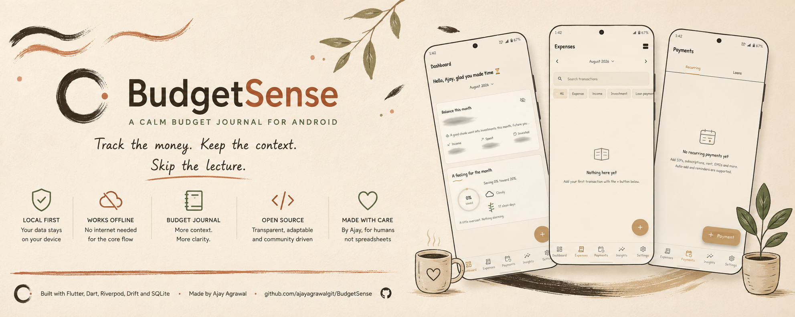
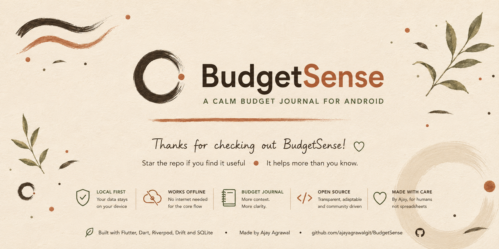

<div align="center">
  
</div>

<div align="center">

**A quiet money journal for your phone.**

It feels like writing in a notebook, not logging into a bank.

<a href="https://github.com/ajayagrawalgit/BudgetSense/releases/latest/download/BudgetSense.apk">
  
</a>

<br />
<br />


<br>
<sub>
  <a href="https://ajayagrawalgit.github.io/BudgetSense/">Website</a>
  &nbsp;·&nbsp;
  <a href="docs/getting-started/install.md">Install</a>
  &nbsp;·&nbsp;
  <a href="docs/SPEC.md">What it does</a>
  &nbsp;·&nbsp;
  <a href="PRIVACY.md">Privacy</a>
  &nbsp;·&nbsp;
  <a href="CHANGELOG.md">Changelog</a>
</sub>

</div>

BudgetSense is the budget app I wanted on my own phone: quick to open, easy to understand, and not constantly trying to turn one coffee into a financial intervention.

At heart, it is a local-first budget journal and expense tracker for Android.
It helps you record money coming in, money going out, and the little details that make those numbers useful when you look back later. It is built with Flutter, Riverpod, Drift, and SQLite.

BudgetSense is not trying to be your bank. It is the notebook beside your bank.

## Why I built it 💭

Hi, I'm Ajay.

I like knowing where my money went. I do not enjoy needing a spreadsheet, three dashboards, and the patience of a tax auditor to figure it out.

BudgetSense came from a simple preference: recording a transaction should take less energy than making the transaction. Open the app, write down what happened, get a clearer picture, and move on with the day.

The goal is not to make personal finance look dramatic. The goal is to make it understandable.

No guilt trip. No spreadsheet cosplay. No chart judging your snack choices.

Just a practical Android budgeting app that helps money feel a little less mysterious.

## What BudgetSense does 💸

BudgetSense is built for normal money: salary, groceries, rent, coffee, subscriptions, and that one purchase you were absolutely sure was "basically free" because it was on sale.

-   **Record income and expenses:** Keep track of money entering and leaving your day-to-day life.
    
-   **Use a budget journal, not a pile of numbers:** Preserve enough context to understand an entry when you revisit it later.
    
-   **Keep core records on the device:** Budget data is persisted locally with Drift and SQLite.
    
-   **Work offline:** The core journal flow does not depend on a BudgetSense cloud backend.
    
-   **Stay Android-first:** The app is designed around a focused mobile experience rather than a desktop dashboard squeezed into a phone.
    
-   **Own the code:** Build it from source, inspect how it works, and adapt it to your workflow.
    

The numbers can be rude. The interface does not have to be.

## Run it locally

### You will need

-   [Flutter](https://docs.flutter.dev/get-started/install)
    
-   The Android SDK, usually installed through [Android Studio](https://developer.android.com/studio)
    
-   An Android emulator or physical Android device
    
-   Git
    

First, make sure Flutter is happy:

```bash
flutter doctor
```

Then clone and run BudgetSense:

```bash
git clone https://github.com/ajayagrawalgit/BudgetSense.git
cd BudgetSense
flutter pub get
flutter run
```

That is it. No seven-part onboarding ceremony. Your terminal has suffered enough.

### Build an APK

```bash
flutter build apk --release
```

The release APK is normally written to:

```text
build/app/outputs/flutter-apk/app-release.apk
```

### Build an Android App Bundle

```bash
flutter build appbundle --release
```

The release bundle is normally written to:

```text
build/app/outputs/bundle/release/app-release.aab
```

## Under the hood ⚙️

BudgetSense keeps the core path fairly boring, on purpose:

```text
Flutter UI
   -> Riverpod state and dependencies
      -> App and data logic
         -> Drift
            -> SQLite on the device

```

There is no BudgetSense runtime backend sitting between the journal and its local database. Wi-Fi should not be a requirement for remembering what you spent at lunch.

<br>

## The honest privacy bit 🔒

BudgetSense deals with personal finance data, so I would rather be precise than decorate this section with padlock emojis.

-   Core budget records are stored locally through Drift and SQLite.
    
-   The core journal flow does not require a BudgetSense cloud account or backend.
    
-   Version `0.1` does not make a blanket claim that all local data is encrypted at rest.
    
-   Local-first does not automatically mean invincible.
    
-   Use a secured device, install builds from sources you trust, and remove private information before sharing logs or screenshots.
    

BudgetSense is a personal budgeting tool. It is not a bank, tax service, investment platform, or financial adviser.

<br>

## Quality checks (If you are a dev)

Run static analysis:

```bash
flutter analyze
```

Run the test suite:

```bash
flutter test
```

Please run both before opening a pull request. Future you will appreciate it, even if present you is pretending not to hear this.

<br>

## Project status

The current open-source release is **version 0.1**.

This is early but a stable software. The interface, data model, and internals can change before `1.0`. A button may also occasionally behave as if it has plans of its own.

Check [GitHub Releases](https://github.com/ajayagrawalgit/BudgetSense/releases) for published builds and release notes.

<br>

## Roadmap 🗺️

These are planned improvements, not claims about features already shipped in version `0.1`.

-   Reliable local backup and restore
    
-   Optional Google Drive backup with explicit opt-in and narrow permissions
    
-   Safer import and export workflows
    
-   More useful spending summaries and reports
    
-   Better accessibility and screen reader support
    
-   More device-level and integration testing
    
-   Automated dependency, security, and release checks
    
-   Continued Android performance and UI polish
    

A roadmap is a direction, not a prophecy. Real bugs and real users are allowed to rearrange it.

<br>

## Contributing 🤝

BudgetSense is a personal project, but it is not a private club.

Bug fixes, small features, accessibility work, test improvements, and documentation cleanups are welcome. For a larger change, please open an [issue](https://github.com/ajayagrawalgit/BudgetSense/issues) first so we can make sure it fits the project before anybody spends a weekend rebuilding half the app.

A normal contribution flow looks like this:

```bash
git checkout -b feature/a-small-useful-thing
flutter analyze
flutter test
git add .
git commit -m "Add a small useful thing"
git push origin feature/a-small-useful-thing
```

Then open a pull request and explain what changed, why it changed, and how you tested it.

Small, focused pull requests are much easier to review than a heroic 47-file surprise.

<br>

### Found a bug?

Please include:

-   What you expected
    
-   What actually happened
    
-   Steps to reproduce it
    
-   Android version and device or emulator details
    
-   BudgetSense version or commit
    
-   Screenshots or logs with personal financial information removed
    

> Do not post real account numbers, transaction details, or other sensitive data in a public issue. The bug does not need your life story, and neither does the internet.

<br>


<br>

## FAQ

### What is BudgetSense?

BudgetSense is an open-source Android budget app built with Flutter. It works as a budget journal, expense tracker, personal finance app, and simple money manager for people who prefer a local-first approach.

### Does BudgetSense work offline?

Yes, the core journal and local data flow are designed to work offline. Core records are stored on the device with Drift and SQLite.

### Do I need a BudgetSense account?

The core local experience does not depend on a BudgetSense cloud account or runtime backend.

### Where is my data stored?

Core budget records are stored locally in SQLite through Drift. Review the source and release notes for the exact behavior of the version you install.

### Is the local database encrypted?

BudgetSense version `0.1` does not make a blanket encryption-at-rest claim. Local storage and encrypted storage are not the same thing, so this README does not pretend otherwise. But even unencrypted part stays 100% with you and on your device.

### How do I install BudgetSense?

You can build the Android app from source with Flutter. Published builds, when available, are listed on the repository's [Releases](https://github.com/ajayagrawalgit/BudgetSense/releases) page.

### Is BudgetSense financial advice?

No. BudgetSense helps organize personal records. It does not provide financial, tax, legal, or investment advice.

## License

See [`LICENSE`](https://chatgpt.com/c/LICENSE) for the terms that apply to this repository.


### Made with ❤️ in India 🇮🇳


BudgetSense is built and maintained by [Ajay Agrawal](https://github.com/ajayagrawalgit).

Made with Flutter, curiosity, and an unreasonable dislike of mystery spending.


If BudgetSense is useful to you, star the repository. It helps other people find the project, and unlike a surprise subscription renewal, it costs nothing.

<div align="center">
  
</div>
