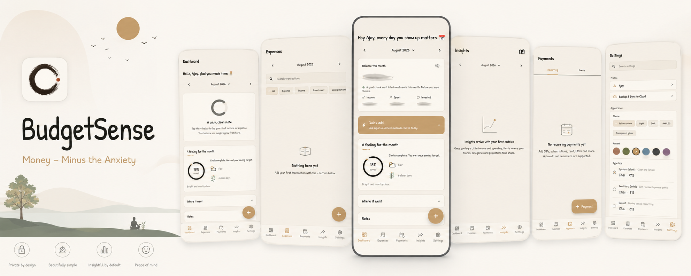

<div align="center">
  
</div>

<div align="center">

**A quiet money journal for your phone.**

It feels like writing in a notebook, not logging into a bank.

<a href="https://github.com/ajayagrawalgit/BudgetSense/releases/latest/download/BudgetSense.apk">
  
</a>

<br />
<br />


<sub>
  <a href="https://ajayagrawalgit.github.io/BudgetSense/">Website</a>
  &nbsp;·&nbsp;
  <a href="docs/getting-started/install.md">Install</a>
  &nbsp;·&nbsp;
  <a href="docs/SPEC.md">What it does</a>
  &nbsp;·&nbsp;
  <a href="PRIVACY.md">Privacy</a>
  &nbsp;·&nbsp;
  <a href="CHANGELOG.md">Changelog</a>
</sub>

</div>

## Why this exists

Most money apps treat you like a suspect. Red numbers. Guilt-trip notifications. Upgrade prompts. And a quiet feeling that your spending is being packaged up and sold somewhere you cannot see.

So a lot of us just stopped looking. Which is the worst possible outcome, because the not-looking is what actually costs money.

BudgetSense is the opposite of that. It is a calm place to write down what came in and what went out, and then get on with your day.

## What it is

A notebook for your money that stays tidy for you.

- Log income, spending, and investments in a few taps
- Keep recurring things in one place: rent, subscriptions, SIPs, EMIs, loans
- See a simple monthly picture: your balance, where it went, gentle insights
- Glance at a widget instead of opening the app
- Get quiet reminders before something is due

No ads. No account. No tracking. Nothing you write leaves your phone unless you switch on backup yourself.

The full feature list lives in [the specification](docs/SPEC.md).

## What it is not

BudgetSense is a personal budgeting tool. It is not financial, investment, tax, or accounting advice. It is not a bank. It cannot promise you any particular result.

Using it is optional, you can stop any time, and the decisions about your money stay yours.

## Your data stays yours

Everything is stored on your device by default.

If you want a backup, you can turn on Google Drive sync. Your data is encrypted on your phone with a passphrase you choose, before anything is uploaded. There is also an optional biometric lock and screenshot blocking.

Details: [Privacy](PRIVACY.md) · [Security](SECURITY.md) · [Backup and recovery](docs/DATA_RECOVERY.md)

## Get it

Download the [latest APK](https://github.com/ajayagrawalgit/BudgetSense/releases/latest/download/BudgetSense.apk), open it on your phone, and allow the install when Android asks.

Step by step: [Install guide](docs/getting-started/install.md)  
Want to check the file first: [Verify your download](docs/getting-started/verify.md)

## Documentation

Everything lives on the [documentation site](https://ajayagrawalgit.github.io/BudgetSense/).

Start at the [overview](docs/getting-started/overview.md), which points to the spec, the design system, the architecture, the backup format, and the security model.

## Building it yourself

You need Flutter 3.44.4, Dart 3.12.x, the Android SDK, and JDK 21.

```bash
flutter pub get
dart run build_runner build --delete-conflicting-outputs
flutter run
```

Contribution setup, conventions, and the quality gate are in [CONTRIBUTING.md](CONTRIBUTING.md).

## Contributing

Issues and pull requests are welcome. If you found a security problem, please follow [SECURITY.md](SECURITY.md) instead of opening a public issue.

Also worth reading: [Code of Conduct](CODE_OF_CONDUCT.md)

## License

GNU GPL v3.0. See [LICENSE](LICENSE).
