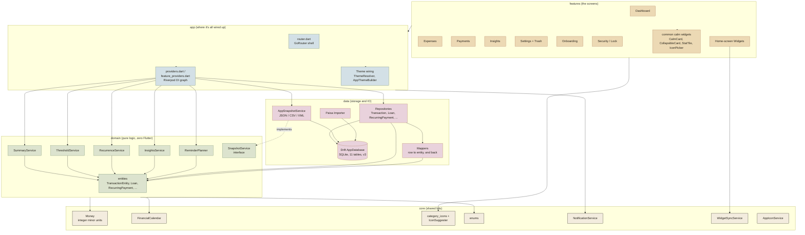
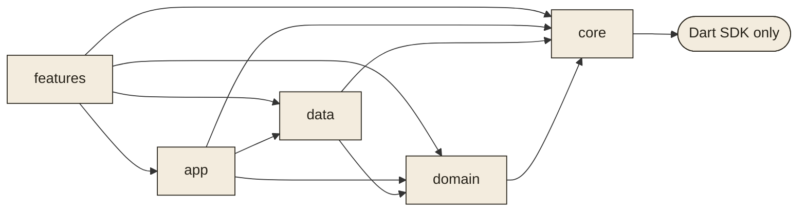
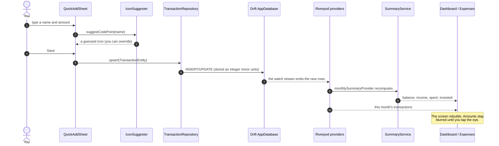
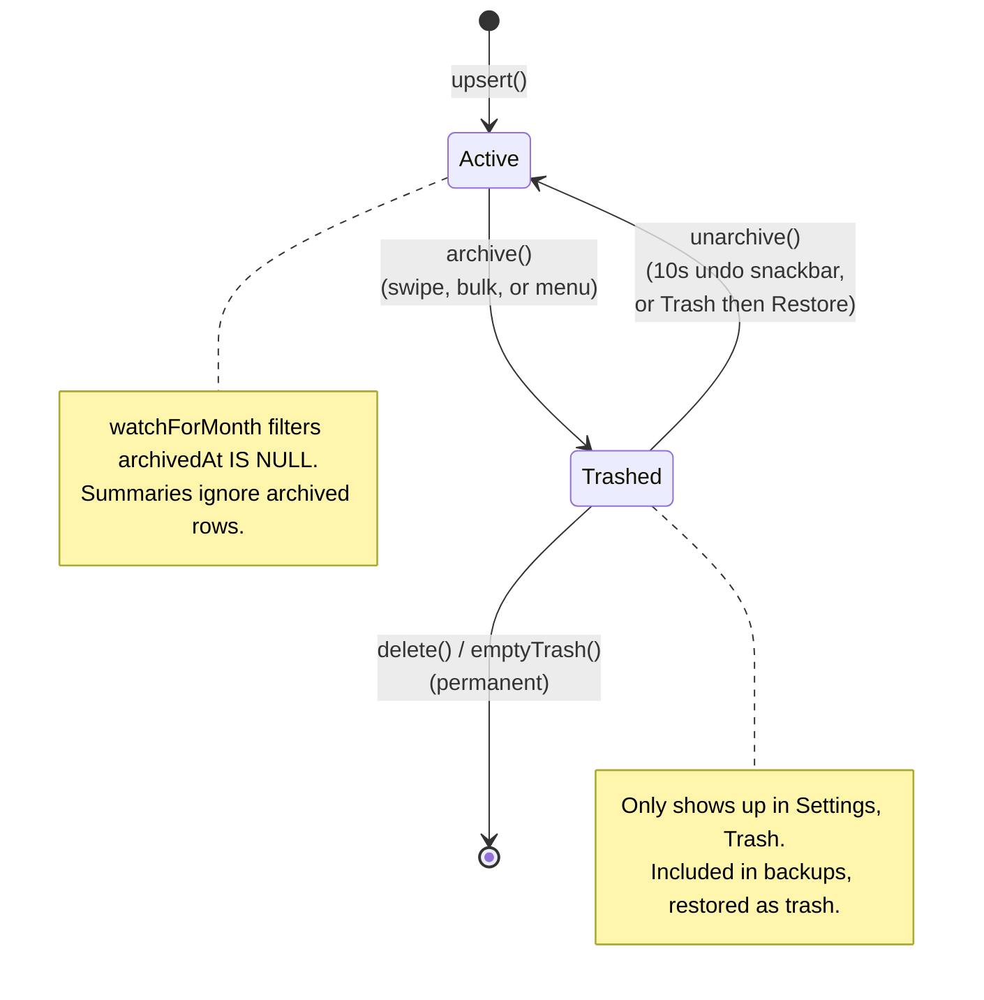
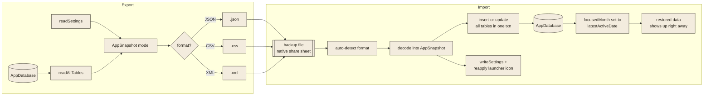
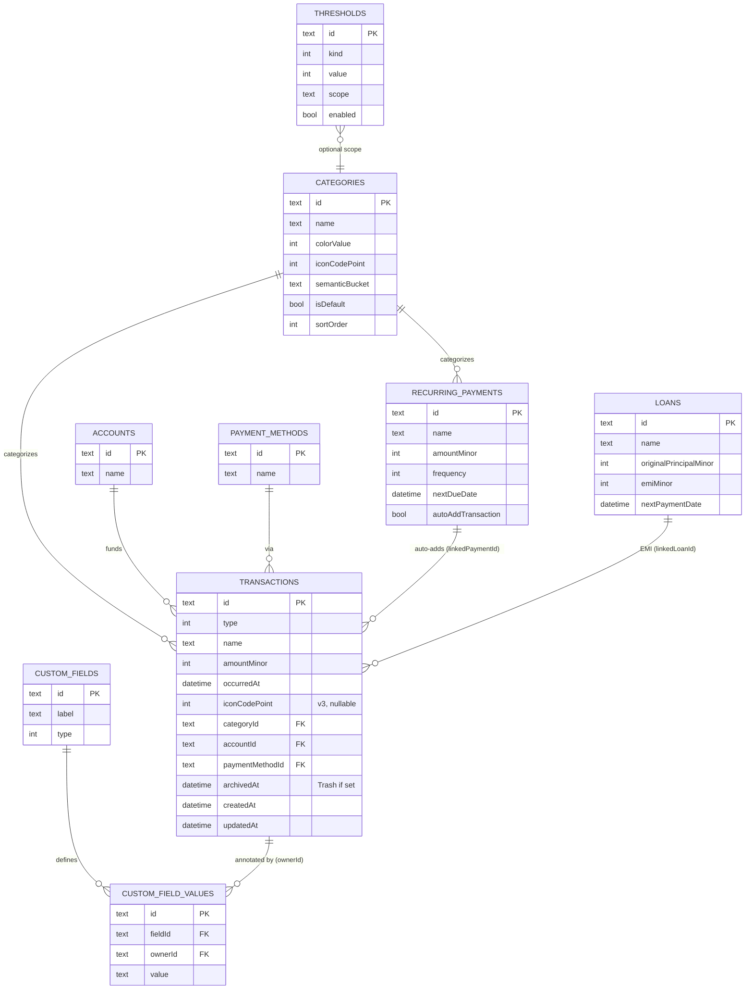
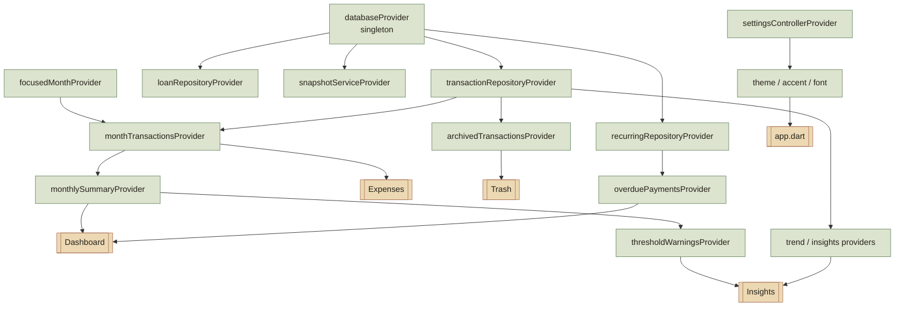
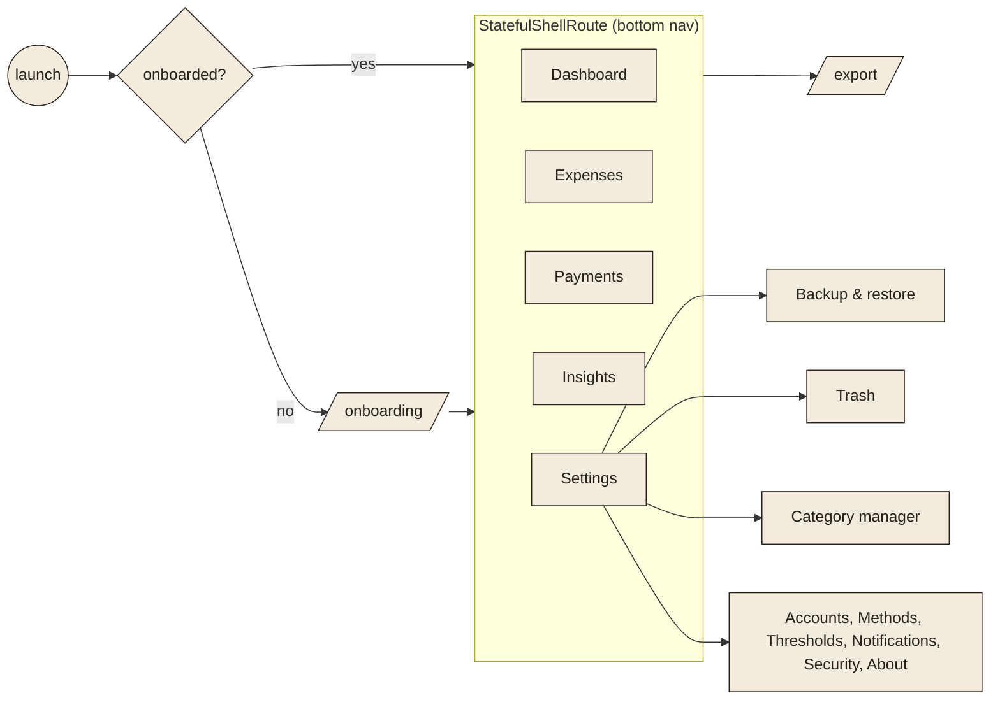

<h1 align="center">BudgetSense: Architecture</h1>

<em>How the pieces fit together: layers, modules, data flow, and the database.</em>

---

This is the map. If [SPEC.md](SPEC.md) is the full instruction manual and
[DESIGN.md](DESIGN.md) is the style guide, this doc is the "here's how it all
hangs together" tour. The diagrams are [Mermaid](https://mermaid.js.org/), so
they render right here on GitHub. Each one has a plain-English note above it in
case you're reading somewhere Mermaid doesn't work.

The whole thing is one Flutter codebase for Android and iOS. It leans on a
clean, layered setup: a pure logic core with no Flutter or database code in it,
a data layer that owns storage, an app layer that wires everything up and
handles routing, and a stack of screens on top. It's offline-first, so all the
state sits in SQLite on the device. Optional Google Drive backup sits on top of
that as an opt-in layer, uploading only an encrypted snapshot, so the offline
path stays the default and works unchanged when cloud backup is off.

---

## 1. The layers

One rule keeps this whole thing honest: dependencies point inward. Screens and
the app layer lean on `data` and `domain`; `data` leans on `domain`; `domain`
leans on nothing but plain Dart. The UI never pokes at the database directly. It
goes through Riverpod providers, which hand back repositories and pure logic
services.

---

## 2. Who's allowed to import whom

Same rule as above, drawn as a strict graph with no loops. If you ever catch
`domain` importing `flutter/material.dart` or a repository, something has gone
sideways and it needs fixing.

---

## 3. What happens when you add a transaction

You save something, it lands in SQLite, and every screen that cares updates on
its own. No screen keeps its own private copy of the data. It all flows out of
Drift streams that Riverpod exposes as providers.

---

## 4. Delete, undo, and the Trash

Deleting never really destroys anything on the first tap. A transaction moves
from active, to trashed, and then either back to active or gone for good. The
`archivedAt` column is the one thing that decides "is this in the Trash".

---

## 5. Backup and restore

A backup grabs the lot: all 11 tables plus every setting you have (profile,
theme, accent, font, app icon), all in one file. Restore doesn't care which
format you picked, and it's forgiving. Columns it doesn't recognize get ignored,
and columns that don't exist yet just fall back to defaults, so an old backup
keeps working after an update.

> Why bother jumping the month after a restore? The dashboard and expenses list
> always open on the current financial month. Without the jump, data restored
> from an older month is sitting there invisibly until you manually page back,
> which honestly just reads as "my imported data vanished". Pointing
> `focusedMonthProvider` at `latestActiveDate()` after a restore puts the data
> right in front of you. The restore also calls `refreshAllDataProviders(ref)`,
> which invalidates every database-backed provider so a bulk import shows up
> instantly in the running session (no app restart), sitting alongside anything
> you added by hand. The same call runs after a Paisa import.

---

## 6. The database

Money is always an INTEGER (minor units), never a float, so rounding can't bite
you. Every record you own carries `id`, `createdAt`, `updatedAt`, `archivedAt`
(the soft delete), and `syncStatus` (used by the optional cloud backup).
Schema version 3 added `transactions.iconCodePoint`.

> `NotificationPreferences` and `ExportRecords` have no foreign keys, so I left
> them out of the diagram to keep it readable. The full column list for every
> table is in [SPEC.md, section 4](SPEC.md).

---

## 7. State: the Riverpod graph

Providers are the seam between the UI and everything behind it. The database is
a stable singleton, and streams run from Drift out to the widgets. The one to
watch is `focusedMonthProvider`, because it decides which month every screen is
looking at.

---

## 8. Getting around: the navigation shell

A `GoRouter` `StatefulShellRoute` holds five branches behind the bottom nav bar.
Onboarding gates the way in, and a few flows (export, the settings sub-pages)
push on top. The settings sub-screens like Backup, Trash, and Category Manager
open with a plain `MaterialPageRoute`.

---

## 9. The rules I try not to break

These are the load-bearing ones. Bend any of them and the design slowly starts
to rot:

1. Money is never a `double`. `Money` wraps integer minor units, and all the math
   and formatting go through it.
2. `domain` stays pure. No Flutter, no Drift, no IO, just Dart and `core`. That's
   what makes the logic so easy to unit test.
3. There's one place that does month math: `monthlySummaryProvider` plus
   `FinancialCalendar`. Screens don't recompute totals on their own.
4. Nothing important is hard-coded. Categories, currencies, thresholds, and icons
   are editable defaults living in the database, not constants baked into widgets.
5. The UI talks to repositories and providers, never straight to the database.
6. Deleting is soft first. A user-facing delete archives; wiping something for
   good is a separate, deliberate action.
7. The icon library only ever grows. `kCategoryIcons` indices stay put so stored
   code points never break.
8. Every row carries `createdAt`, `updatedAt`, `archivedAt`, and `syncStatus`,
   which is what lets the snapshot and cloud backup work without a migration.

---

_For the full behaviour, see [SPEC.md](SPEC.md). For the full visual system, see
[DESIGN.md](DESIGN.md)._
