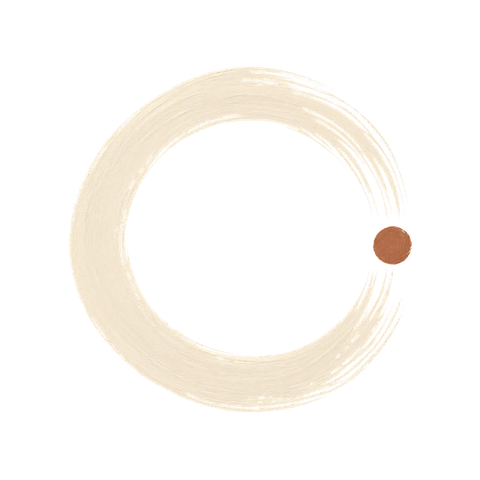

# Branding

BudgetSense looks like a paper notebook, not a banking app. Everything below
exists to keep it that way.

Both variants of the mark, which is what a brand guide should show anyway. Use
Markdown image syntax rather than raw HTML here: MkDocs rewrites the path for its
directory URLs, and the same path still resolves when the file is read on GitHub.

| On light surfaces | On dark surfaces |
| --- | --- |
|  |  |

## The character

Calm, intentional, private, tactile. Minimal but warm: Japanese editorial
minimalism rather than Scandinavian austerity, closer to a Muji notebook than to
a dashboard. Premium without luxury signalling; handcrafted without rusticity.

The mark is an **ensō**: a circle drawn in one breath with a dry brush, left
deliberately open, with a single clay dot where the stroke began. It stands for a
practice rather than a target, the circle is never quite closed, and that is the
point.

Things that are never part of this brand: coins, wallets, piggy banks, generic
upward arrows, gloss, neon, gradients-as-decoration, and the blue that every
other finance app uses.

## Palette

| Role | Colour | Hex |
| --- | --- | --- |
| Paper / background | Handmade cream | `#EFE7D6` |
| Ink / text | Deep espresso | `#262219` |
| Accent | Terracotta clay | `#B07C5E` |
| Secondary surface | Sand | `#D9C6A8` |
| Muted ink | Earth brown | `#5A4A3C` |

Terracotta is the only accent, and it carries hierarchy by being scarce. One
terracotta element per screen, on the single most important thing. When a second
element also wants to be terracotta, one of them is not actually important.

Sage `#6E8B6A` and clay-red `#B4675E` are **semantic**, not brand colours: they
mean "money came in" and "money went out". Never use sage as a primary or
decorative colour, that reads as a different product.

The in-app source of truth is
[`lib/core/theme/app_colors.dart`](https://github.com/ajayagrawalgit/BudgetSense/blob/main/lib/core/theme/app_colors.dart).
Read colours from `context.colors`; never hardcode a hex value in a widget.

## Typography

Zen Maru Gothic carries the interface: a rounded gothic with enough warmth to
feel handwritten-adjacent while staying completely legible at small sizes. The
handwriting faces (Caveat, Patrick Hand, Gochi Hand, Architect's Daughter) are
for accents and personal touches only, never for numbers or controls.

## Using the marks

The logos are **two-colour** (an ink ring plus a terracotta dot), so they ship
as a light/dark pair. Choose with `BrandMarks.of(context)`:

```dart
Image.asset(BrandMarks.of(context), excludeFromSemantics: true);
```

Espresso ink disappears on an espresso surface and cream ink disappears on
cream, so this is a correctness matter, not a preference. Never tint a logo:
that would flatten the ring and the dot into one colour.

The decoratives are **single-colour alpha masks**. The dry-brush texture lives
entirely in the alpha channel, so one file adapts to any theme colour:

```dart
BrandMarks.tinted(BrandAssets.ensoRing, color: colors.textFaint, size: 92);
```

Rules that keep the marks feeling deliberate:

- **One strong gesture per screen.** A logo *and* a divider *and* a sprig is
  three competing voices.
- **Give the mark room.** At least 12% of the mark's own width as clear space on
  every side. The derived assets already bake this in.
- **Decoratives are faint.** Draw them in `colors.textFaint`, never in the
  accent, unless the mark *is* the accent (the seal, the underline).
- **Decoration is not content.** Leave `semanticLabel` null so screen readers
  skip it.
- **Never re-colour, rotate, stretch, outline, or add effects to the ensō.**

### What each asset is for

Only the marks a screen actually draws are bundled into the app. The rest are
derived and kept on disk as a design kit, because a mark nobody draws is just
weight in every install. To start using one, declare its path in `pubspec.yaml`
and add a constant to `BrandAssets`.

| Asset | Bundled | Use |
| --- | --- | --- |
| `budgetsense-logo-primary-on-light` | Yes | The logo, on cream and other light surfaces |
| `budgetsense-logo-inverse-on-dark` | Yes | The logo, on espresso and other dark surfaces |
| `budgetsense-enso-ring` | Yes | Loading, and the clean-slate empty state |
| `budgetsense-seal-terracotta` | Yes | Where sealing is the literal meaning: a finished export, a closed month |
| `budgetsense-waves` | Yes | Water crossing the page, once, on a deliberate over-pull |
| `budgetsense-mark-compact` | Platform | Favicons and any place under ~48 px |
| `budgetsense-mark-monochrome` | Platform | Themed/tinted contexts; the Android monochrome layer |
| `budgetsense-botanical` | Design kit | Calm empty states, onboarding edge detail |
| `budgetsense-milestone` | Design kit | Genuine milestones only |
| `budgetsense-divider-espresso` | Design kit | Sparse editorial separation between sections |
| `budgetsense-underline-terracotta` | Design kit | One emphasised heading at a time |

## Platform assets

The Android launcher icon is the ensō with its terracotta dot on cream paper.
The cream background is **not** overridden in dark mode: the ink is dark, so a
dark tile would erase the mark. The monochrome layer used by Android 13+ themed
icons is a flat silhouette of the same ring.

The splash is one quiet moment: the field colour matches the app's own
background so there is no flash as Flutter takes over. On Android 12+ the system
composites the launcher icon over that field; no animated icon is supplied,
deliberately.

The notification icon is a white silhouette, because Android builds status-bar
icons from the alpha channel alone. Passing the launcher tile there would render
a solid white square.

## Regenerating the derived assets

`assets/branding/` holds the hand-authored masters and is the only place artwork
is edited by hand. Everything else is generated and safe to delete:

```bash
python3 -m venv /tmp/bsimg && /tmp/bsimg/bin/pip install Pillow numpy
/tmp/bsimg/bin/python tool/brand_assets.py
```

That writes `assets/branding/derived/` (the subset that ships in the app),
the Android launcher, splash and notification resources, and
`docs/assets/brand/` (site and social artwork).

Pillow is a build-time tool only, deliberately not a dependency of the app or the
docs site. The masters total tens of megabytes and are **not** bundled, only the
individual derived files listed in `pubspec.yaml` are. If you add a derived
asset, add it to that list explicitly rather than bundling the directory.

See [`assets/branding/MANIFEST.md`](https://github.com/ajayagrawalgit/BudgetSense/blob/main/assets/branding/MANIFEST.md)
for what each master is and which derived assets come from it.
